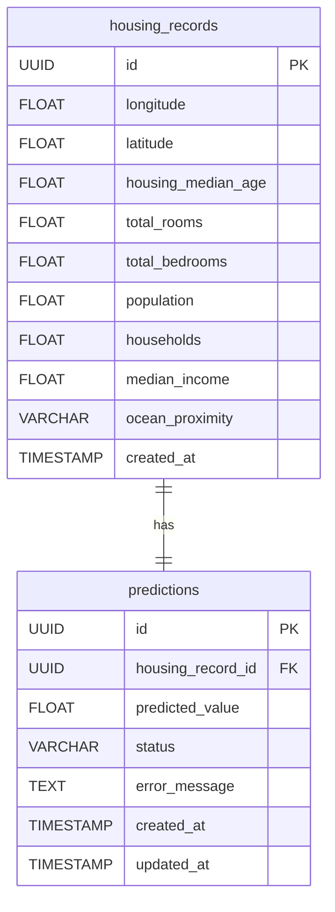

# Housing ML Pipeline

A machine learning pipeline for housing price predictions using hexagonal architecture, FastAPI, Dagster, and PostgreSQL. This project demonstrates clean architecture principles and modern development practices for building maintainable, testable, and scalable ML systems.

## Overview

This project implements a machine learning pipeline for predicting housing prices based on property characteristics. Key features include:
- Asynchronous processing with Dagster ETL pipeline
- Clean architecture with hexagonal design
- RESTful API with FastAPI
- Comprehensive monitoring and testing
- Dockerized deployment

## Quick Start

### Local Deployment
```bash
# Clone the repository
git clone https://github.com/j-soro/housing-ml-pipeline.git
cd housing-ml-pipeline

# Create models directory and add a model file
mkdir -p models
# You should have a 'model.joblib' in the ./models directory

# For production deployment
docker-compose up -d

# For development (with hot-reloading)
docker-compose -f docker-compose.yml -f docker-compose.dev.yml up -d

# Verify services are running
docker-compose ps
```

### API Usage
```python
import requests

# 1. Send your house data
response = requests.post("http://localhost:8000/predictions", json={
    "longitude": -122.23,
    "latitude": 37.88,
    "housing_median_age": 41.0,
    "total_rooms": 880.0,
    "total_bedrooms": 129.0,
    "population": 322.0,
    "households": 126.0,
    "median_income": 8.3252,
    "ocean_proximity": "NEAR BAY"
})

# 2. Get your prediction ID
run_id = response.json()["run_id"]

# 3. Check your prediction (when ready)
result = requests.get(f"http://localhost:8000/predictions/{run_id}")
prediction = result.json()["prediction"]
print(f"Predicted house price: ${prediction:,.2f}")
```

## Architecture

This project follows hexagonal (ports and adapters) architecture to create a maintainable, testable, and scalable system.

### Component Diagram


### Sequence Diagram


### Key Components

#### Core Domain
- **Entities**: `HousingRecord`, `Prediction`, `PredictionStatus`
- **Value Objects**: `OceanProximity`
- **Domain Services**: `PredictionService`
- **Ports**: `InputPort`, `ETLPort`, `StoragePort`, `ModelPort`

#### Adapters
- **Driving Adapters**: FastAPI REST API, Handler, API Models
- **Driven Adapters**: PostgreSQL, Sklearn Model, Dagster ETL

## Development

### Prerequisites
- Docker
- Docker Compose
- Python 3.9+ (for local development)
- Poetry (for local development)

### Setup
```bash
# Clone and setup
git clone https://github.com/j-soro/housing-ml-pipeline.git
cd housing-ml-pipeline
python -m venv .venv
source .venv/bin/activate  # On Windows: .venv\Scripts\activate
pip install poetry
poetry install

# Configuration
cp .env.example .env
mkdir -p models
# Add your model.joblib to the models directory
```

### Testing
The project includes comprehensive test coverage:

```bash
# Run all tests
pytest

# Run specific test categories
pytest tests/unit/     # Unit tests
pytest tests/integration/  # Integration tests
```

#### Test Structure
- **Unit Tests**: Test individual components in isolation
- **Integration Tests**: Test component interactions
- **Test Assets**: Mock data and fixtures for testing
- **Test Base**: Common test utilities and configurations

### Monitoring
The system includes comprehensive monitoring setup:

- **Dagster UI**: Pipeline monitoring and debugging
- **Prometheus**: Metrics collection
- **Grafana**: Visualization and dashboards

Access monitoring:
- Dagster UI: http://localhost:3000/runs (view pipeline runs, debug asset materializations, and monitor pipeline status)
- Grafana: http://localhost:3001
- Prometheus: http://localhost:9090


## API Documentation

- [OpenAPI Specification](openapi.json)
- [Swagger UI](http://localhost:8000/docs)
- [ReDoc](http://localhost:8000/redoc)

### Endpoints

#### Submit Prediction Request
```bash
POST /predictions
Content-Type: application/json

{
    "longitude": -122.23,
    "latitude": 37.88,
    "housing_median_age": 41.0,
    "total_rooms": 880.0,
    "total_bedrooms": 129.0,
    "population": 322.0,
    "households": 126.0,
    "median_income": 8.3252,
    "ocean_proximity": "NEAR BAY"
}
```

#### Get Prediction Result
```bash
GET /predictions/{run_id}
```

## Project Structure
```
.
├── src/
│   ├── adapter/           # Adapters for external services
│   │   ├── driving/       # Driving adapters (FastAPI)
│   │   └── driven/        # Driven adapters (PostgreSQL, ML, Dagster)
│   ├── core/              # Core domain logic
│   │   ├── domain/        # Domain entities and value objects
│   │   ├── port/          # Port interfaces
│   │   └── service/       # Domain services
│   └── config/            # Configuration and DI container
├── models/                # Model artifacts directory
├── tests/                # Test suite
├── prometheus/          # Prometheus configuration
├── grafana/            # Grafana dashboards
├── docker-compose.yml    # Docker services configuration
├── docker-compose.dev.yml # Development environment configuration
├── Dockerfile           # Application container definition
├── pyproject.toml       # Python dependencies
└──
```

## Database Schema

The system uses PostgreSQL to store both the cleaned input data and prediction results. Below is the database schema:

### Entity Relationship Diagram



### Tables

#### `housing_records`
Stores the cleaned housing data submitted for prediction.

| Column | Type | Description |
|--------|------|-------------|
| id | UUID | Primary key, auto-generated |
| longitude | FLOAT | Longitude of the property |
| latitude | FLOAT | Latitude of the property |
| housing_median_age | FLOAT | Median age of houses in the block |
| total_rooms | FLOAT | Total number of rooms in the block |
| total_bedrooms | FLOAT | Total number of bedrooms in the block |
| population | FLOAT | Total population in the block |
| households | FLOAT | Total number of households in the block |
| median_income | FLOAT | Median income of households in the block |
| ocean_proximity | VARCHAR | Proximity to the ocean (e.g., 'NEAR BAY', 'INLAND') |
| created_at | TIMESTAMP | When the record was created |

#### `predictions`
Stores the prediction results for each housing record.

| Column | Type | Description |
|--------|------|-------------|
| id | UUID | Primary key, auto-generated |
| housing_record_id | UUID | Foreign key to housing_records |
| predicted_value | FLOAT | The predicted house value |
| status | VARCHAR | Status of the prediction ('pending', 'running', 'completed', 'failed') |
| error_message | TEXT | Error message if prediction failed (nullable) |
| created_at | TIMESTAMP | When the prediction was created |
| updated_at | TIMESTAMP | When the prediction was last updated |

### Relationships

- Each `prediction` record is associated with exactly one `housing_record` through the `housing_record_id` foreign key.
- A `housing_record` has exactly one `prediction` record.

### Indexes

The following indexes are recommended for optimal performance:

- Primary key indexes on `id` columns (automatically created by PostgreSQL)
- Foreign key index on `housing_record_id` in the `predictions` table (automatically created by PostgreSQL)
- Index on `status` in the `predictions` table for efficient status queries

To implement these indexes, you would add the following SQL:

```sql
-- Index on status for efficient status queries
CREATE INDEX idx_predictions_status ON predictions(status);
```

## Development

### Commands
```bash
# Install dependencies and set up pre-commit hooks
make setup

# Run tests
make test

# Run tests with coverage
make coverage

# Lint and type checking
make lint

# Format code
make format

# Run all checks (format, lint, test)
make check

# Clean cache files
make clean

# Update dependencies
make update
```

### Development Tools
- Poetry for dependency management
- Ruff for linting
- MyPy for type checking
- Pre-commit hooks for code quality

## Troubleshooting

### Common Issues

#### 1. PostgreSQL Connection
- **Issue**: App can't connect to PostgreSQL
- **Solution**: Check PostgreSQL container health
```bash
docker-compose ps
docker-compose logs postgres
```

#### 2. Model Loading
- **Issue**: Model file not found
- **Solution**: Verify model path and permissions
```bash
docker-compose exec app ls -l /app/models
```

#### 3. Dagster Issues
- **Issue**: Dagster UI not accessible
- **Solution**: Check Dagster logs
```bash
docker-compose logs dagster-webserver
```

#### 4. Port Conflicts
- **Issue**: Services fail to start
- **Solution**: Check port usage
```bash
# Windows
netstat -ano | findstr "5432 8000 3000"
# Linux/Mac
lsof -i :5432,8000,3000
```

## Verification

### 1. Check Services
```bash
docker-compose ps
```

### 2. Verify API
```bash
curl http://localhost:8000/docs
```

### 3. Verify Dagster UI
- Open http://localhost:3000 in browser

## License
MIT License
