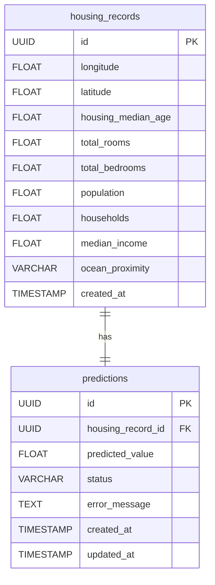

# Housing ML Pipeline

A machine learning pipeline for housing price predictions using hexagonal architecture, FastAPI, Dagster, and PostgreSQL. This project demonstrates clean architecture principles and modern development practices for building maintainable, testable, and scalable ML systems.

## Quick Start

### Local Deployment
```bash
# Clone the repository
git clone <repository-url>
cd housing-ml-pipeline

# Create models directory and add a model file
mkdir -p models
# You should have a 'model.joblib' in the ./models directory

# For production deployment
docker-compose up -d

# For development (with hot-reloading)
docker-compose -f docker-compose.yml -f docker-compose.dev.yml up -d

# Verify services are running
docker-compose ps
```

### API Usage
```python
import requests

# 1. Send your house data
response = requests.post("http://localhost:8000/predictions", json={
    "longitude": -122.23,
    "latitude": 37.88,
    "housing_median_age": 41.0,
    "total_rooms": 880.0,
    "total_bedrooms": 129.0,
    "population": 322.0,
    "households": 126.0,
    "median_income": 8.3252,
    "ocean_proximity": "NEAR BAY"
})

# 2. Get your prediction ID
run_id = response.json()["run_id"]

# 3. Check your prediction (when ready)
result = requests.get(f"http://localhost:8000/predictions/{run_id}")
prediction = result.json()["prediction"]
print(f"Predicted house price: ${prediction:,.2f}")
```

The API follows an asynchronous pattern where you submit data (POST) and receive a run ID, then check the status separately using that run ID as a path parameter (GET).
This allows for non-blocking operation during the ML pipeline execution.

## Overview

This project implements a machine learning pipeline for predicting housing prices based on property characteristics. It follows hexagonal architecture principles to create a maintainable, testable, and scalable system.

### Key Features
- **Asynchronous Processing**: Submit prediction requests and retrieve results asynchronously
- **Clean Architecture**: Clear separation of concerns with ports and adapters
- **ETL Pipeline**: Automated data cleaning, transformation, and prediction workflow
- **RESTful API**: Simple HTTP interface for submitting and retrieving predictions
- **Dockerized**: Easy deployment with containerized services

### How It Works
1. **Submit Data**: Send housing property data to `POST /predictions` endpoint
2. **Process Asynchronously**: The system triggers a Dagster ETL pipeline and returns a run ID
3. **Pipeline Execution**: The pipeline performs:
   - Data cleaning and transformation
   - Clean data persistence to PostgreSQL
   - ML model prediction on the data
   - Result storage in PostgreSQL
4. **Check Status**: Use `GET /predictions/{run-id}` to check the current status of any pipeline run

This architecture demonstrates clean code principles, dependency injection, and separation of concerns while providing a practical solution for ML prediction workflows.

## System Architecture

This project follows hexagonal (ports and adapters) architecture to create a maintainable, testable, and scalable system. The architecture ensures clear separation of concerns, making the system easier to understand, test, and extend.

### Component Diagram


The component diagram illustrates the hexagonal architecture of the system, showing:
- Core domain entities and services at the center
- Ports defining the system boundaries
- Adapters implementing the ports
- External systems and their relationships

### Sequence Diagram


The sequence diagram illustrates the asynchronous flow of a prediction request through the system using two different endpoints:
1. **Submit Request** (`POST /predictions`): Client submits housing property data to the API
2. **Process Asynchronously**: API handler processes the request and triggers the Dagster pipeline, immediately returning a run ID to the client
3. **Pipeline Execution**: The pipeline performs data cleaning, transformation, and prediction in the background
4. **Check Status** (`GET /predictions/{run-id}`): Client can poll this endpoint at any time using the run ID to check the current status
5. **Return Results**: Once complete, the client receives the prediction results in the response

This asynchronous pattern allows the system to handle long-running predictions without blocking the client, which can continue with other tasks while waiting for results.

### Architecture Components

#### Core Domain
- **Entities**: `HousingRecord`, `Prediction`, `PredictionStatus`
- **Value Objects**: `OceanProximity`
- **Domain Services**: `PredictionService`
- **Ports**: `InputPort`, `ETLPort`, `StoragePort`, `ModelPort`

#### Adapters
- **Driving Adapters**:
  - FastAPI REST API
  - FastAPI Handler
  - API Models (Request/Response DTOs)
- **Driven Adapters**:
  - PostgreSQL Adapter
  - Sklearn Model Adapter
  - Dagster ETL Adapter

#### External Systems
- PostgreSQL Database
- Dagster Pipeline
- ML Model (scikit-learn)

## Prerequisites

- Docker
- Docker Compose
- Python 3.9+ (for local development)
- Poetry (for local development)

## Setup

### 1. Initial Setup
```bash
# Clone the repository
git clone <repository-url>
cd housing-ml-pipeline

# Create and activate a Python 3.9 virtual environment
python -m venv .venv
source .venv/bin/activate  # On Windows: .venv\Scripts\activate

# Install Poetry
pip install poetry

# Install dependencies
poetry install
```

### 2. Configuration
```bash
# Copy environment template
cp .env.example .env

# Create models directory
mkdir -p models
```

### 3. Model Setup
```bash
# Copy your trained model
cp /path/to/your/model.joblib models/model.joblib
```

### 4. Start Services
```bash
# Start all services
docker-compose up -d

# Check logs
docker-compose logs -f
```

## API Documentation

The API documentation is available in several formats:

- [OpenAPI Specification](openapi.json) - Complete API specification in JSON format
- [Swagger UI](http://localhost:8000/docs) - Interactive API documentation (when running)
- [ReDoc](http://localhost:8000/redoc) - Alternative API documentation (when running)

## API Endpoints

The API follows an asynchronous pattern where clients submit prediction requests and then check their status separately.

### Submit Prediction Request
```bash
POST /predictions
Content-Type: application/json

{
    "longitude": -122.23,
    "latitude": 37.88,
    "housing_median_age": 41.0,
    "total_rooms": 880.0,
    "total_bedrooms": 129.0,
    "population": 322.0,
    "households": 126.0,
    "median_income": 8.3252,
    "ocean_proximity": "NEAR BAY"
}
```

**Response**: Returns a run ID that can be used to check the status of the prediction.
```json
{
    "run_id": "123e4567-e89b-12d3-a456-426614174000"
}
```

### Get Prediction Result
```bash
GET /predictions/{run_id}
```

**Response**: Returns the current status of the prediction. If the prediction is complete, it also includes the prediction result.
```json
{
    "status": "completed",
    "prediction": 320201.58554044
}
```

**Possible Status Values**:
- `pending`: The prediction request has been received but processing hasn't started
- `running`: The prediction is currently being processed
- `completed`: The prediction has been completed successfully
- `failed`: The prediction failed (includes error details)

## Project Structure

```
.
├── src/
│   ├── adapter/           # Adapters for external services
│   │   ├── driving/       # Driving adapters (FastAPI)
│   │   └── driven/        # Driven adapters (PostgreSQL, ML, Dagster)
│   ├── core/              # Core domain logic
│   │   ├── domain/        # Domain entities and value objects
│   │   ├── port/          # Port interfaces
│   │   └── service/       # Domain services
│   └── config/            # Configuration and DI container
├── models/                # Model artifacts directory
├── tests/                # Test suite
├── docker-compose.yml    # Docker services configuration
├── docker-compose.dev.yml # Development environment configuration
├── Dockerfile           # Application container definition
├── pyproject.toml       # Python dependencies
└──
```

## Database Schema

The system uses PostgreSQL to store both the cleaned input data and prediction results. Below is the database schema:

### Entity Relationship Diagram



### Tables

#### `housing_records`
Stores the cleaned housing data submitted for prediction.

| Column | Type | Description |
|--------|------|-------------|
| id | UUID | Primary key, auto-generated |
| longitude | FLOAT | Longitude of the property |
| latitude | FLOAT | Latitude of the property |
| housing_median_age | FLOAT | Median age of houses in the block |
| total_rooms | FLOAT | Total number of rooms in the block |
| total_bedrooms | FLOAT | Total number of bedrooms in the block |
| population | FLOAT | Total population in the block |
| households | FLOAT | Total number of households in the block |
| median_income | FLOAT | Median income of households in the block |
| ocean_proximity | VARCHAR | Proximity to the ocean (e.g., 'NEAR BAY', 'INLAND') |
| created_at | TIMESTAMP | When the record was created |

#### `predictions`
Stores the prediction results for each housing record.

| Column | Type | Description |
|--------|------|-------------|
| id | UUID | Primary key, auto-generated |
| housing_record_id | UUID | Foreign key to housing_records |
| predicted_value | FLOAT | The predicted house value |
| status | VARCHAR | Status of the prediction ('pending', 'running', 'completed', 'failed') |
| error_message | TEXT | Error message if prediction failed (nullable) |
| created_at | TIMESTAMP | When the prediction was created |
| updated_at | TIMESTAMP | When the prediction was last updated |

### Relationships

- Each `prediction` record is associated with exactly one `housing_record` through the `housing_record_id` foreign key.
- A `housing_record` has exactly one `prediction` record.

### Indexes

The following indexes are recommended for optimal performance:

- Primary key indexes on `id` columns (automatically created by PostgreSQL)
- Foreign key index on `housing_record_id` in the `predictions` table (automatically created by PostgreSQL)
- Index on `status` in the `predictions` table for efficient status queries

To implement these indexes, you would add the following SQL:

```sql
-- Index on status for efficient status queries
CREATE INDEX idx_predictions_status ON predictions(status);
```

## Development

### Commands
```bash
# Install dependencies and set up pre-commit hooks
make setup

# Run tests
make test

# Run tests with coverage
make coverage

# Lint and type checking
make lint

# Format code
make format

# Run all checks (format, lint, test)
make check

# Clean cache files
make clean

# Update dependencies
make update
```

### Development Tools
- Poetry for dependency management
- Ruff for linting
- MyPy for type checking
- Pre-commit hooks for code quality

## Troubleshooting

### Common Issues

#### 1. PostgreSQL Connection
- **Issue**: App can't connect to PostgreSQL
- **Solution**: Check PostgreSQL container health
```bash
docker-compose ps
docker-compose logs postgres
```

#### 2. Model Loading
- **Issue**: Model file not found
- **Solution**: Verify model path and permissions
```bash
docker-compose exec app ls -l /app/models
```

#### 3. Dagster Issues
- **Issue**: Dagster UI not accessible
- **Solution**: Check Dagster logs
```bash
docker-compose logs dagster-webserver
```

#### 4. Port Conflicts
- **Issue**: Services fail to start
- **Solution**: Check port usage
```bash
# Windows
netstat -ano | findstr "5432 8000 3000"
# Linux/Mac
lsof -i :5432,8000,3000
```

## Verification

### 1. Check Services
```bash
docker-compose ps
```

### 2. Verify API
```bash
curl http://localhost:8000/docs
```

### 3. Verify Dagster UI
- Open http://localhost:3000 in browser

## License
MIT License
